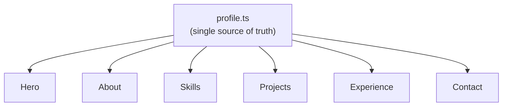

<div align="center">

# Nil Bangoriya — Portfolio

### A 3D, Motion-Driven Portfolio Site Powered by One Config File


</div>

<!-- Add a screenshot or short GIF of the site here for maximum impact -->

<br/>

The source for my personal portfolio: a React + TypeScript site with a layered WebGL background, scroll-driven motion throughout, and every section — Hero, About, Skills, Projects, Experience, Contact — rendered from a single typed content file.

## Table of Contents

- [Key Features](#key-features)
- [Tech Stack](#tech-stack)
- [Getting Started](#getting-started)
- [Customizing Content](#customizing-content)
- [Project Structure](#project-structure)
- [Roadmap](#roadmap)
- [License](#license)

## Key Features

- 🌌 **Custom WebGL 3D background** — a layered depth scene (starfield, neural-network field, orbs, atmosphere, parallax camera) built with React Three Fiber + Drei
- 🖱️ **Custom cursor** with hover effects on desktop
- 🎬 **Scroll-driven animation system** — reveal, stagger, parallax, scale, text-reveal effects and a scroll progress bar, all built on Framer Motion
- ⚙️ **Single config file** — every section renders from one typed `profile.ts` object; update content without touching component code
- 📱 **Fully responsive**, with dedicated mobile navigation
- 🔷 **Type-safe throughout** — React + TypeScript with typed content interfaces (`Project`, `Experience`, `SkillCategory`)

**Design notes:**
- **Content/presentation separation** — `src/data/profile.ts` is the single source of truth for every section; components are purely presentational and re-render from typed data rather than hardcoded copy
- **3D and 2D animation kept in separate layers** — `components/depth/` (Three.js scene) and `components/animations/` (Framer Motion scroll primitives) are independent, so either can be swapped or disabled without touching the other



## Tech Stack

| Layer | Technology |
|---|---|
| Framework | React 18, TypeScript |
| Build tool | Vite 6 |
| Styling | Tailwind CSS |
| Animation | Framer Motion |
| 3D / WebGL | Three.js, React Three Fiber, Drei |

## Getting Started

### Prerequisites
- Node.js 18+

### Installation & Development
```bash
git clone https://github.com/NilBangoriya/Portfolio.git
cd Portfolio
npm install
npm run dev
```
Open [http://localhost:5173](http://localhost:5173).

### Production Build
```bash
npm run build      # type-checks with tsc -b, then builds
npm run preview    # preview the production build locally
```
Deploy the `dist/` folder to Vercel, Netlify, or GitHub Pages.

## Customizing Content

Everything on the site is driven by one file: **`src/data/profile.ts`** — name, tagline, location, contact links, about copy, stats, skills, projects, and experience. Edit that file and every section picks up the change; no need to touch the components themselves.

## Project Structure

```
Portfolio/
├── src/
│   ├── components/
│   │   ├── Hero.tsx / About.tsx / Skills.tsx / Projects.tsx
│   │   ├── Experience.tsx / Contact.tsx / Navigation.tsx / Footer.tsx
│   │   ├── CustomCursor.tsx
│   │   ├── animations/     # Scroll-driven animation primitives (Framer Motion)
│   │   └── depth/          # WebGL 3D background scene (React Three Fiber)
│   ├── data/
│   │   └── profile.ts      # Single source of truth for all site content
│   ├── hooks/
│   │   └── useDepthMotion.tsx
│   └── lib/
│       └── scrollAnimations.ts
├── index.html
├── tailwind.config.js
├── vite.config.ts
└── package.json
```

## Roadmap

- [ ] Deploy to Vercel/Netlify and link the live URL here
- [ ] Wire up `resumeUrl` in `profile.ts` to a hosted resume (currently a placeholder)
- [ ] Add Open Graph / meta tags for link previews when shared
- [ ] Accessibility pass — respect `prefers-reduced-motion` for the custom cursor and 3D background

## License

No license has been specified yet. Consider adding a `LICENSE` file (MIT is a common, permissive default for portfolio projects) so others know how they're allowed to use this code.

---

<div align="center">

Built by **Nil Bangoriya** · [GitHub](https://github.com/nilbangoriya) · [LinkedIn](https://linkedin.com/in/nilbangoriya) · [Email](mailto:nilbangoriya1234@gmail.com)

</div>
